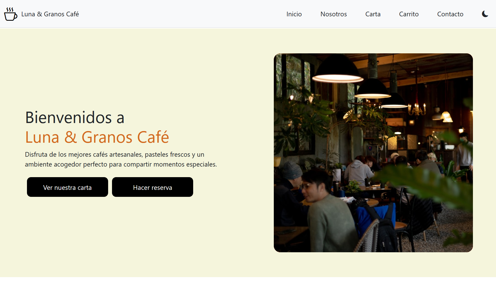

<h1 align="center">☕ Cafetería Luna & Granos Cafe ☕ - TP Grupo 11</h1>
<h3 align="center">Trabajo Práctico - Primer Parcial</h3>


---

## 📘 Descripción del proyecto

Este proyecto es una página web de una **cafetería**.
La aplicación fue creada con **React** y **Bootstrap**, y permite navegar entre diferentes secciones del sitio:

- 🏠 **Inicio:** Presentación de la cafetería
- 👥 **Nosotros:** Información sobre el equipo y la historia del lugar
- ☕ **Carta:** Listado de productos como cafés, muffins, cheesecake, croissants, sandwich veggie, entre otros
- 🛒 **Carrito:** Sección para comprar los productos seleccionados
- 📞 **Contacto:** Formulario para reservar tu lugar e informacion de contacto

---

## Instrucciones para correr en local

1. **Clonar el repositorio**

```
git clone https://github.com/franquinator/tp-grupo-11.git
```

2. **Ingresar a la carpeta del repositorio**

```
cd tp-grupo-11
```

3. **Instalar dependecias**

```
npm install
```

4. **Ejecutar el servidor**

```
npm run dev
```

5. **Abrir el link de la pagina**
   una vez iniciado el servidor, abrir el enlace a la pagina. Por ejemplo (http://localhost:5173/)

## Integrantes:

- #### Facundo Chavez
- #### Facundo Nicolas Torres
- #### Franco Iannone
- #### Lucas Crusvar
- #### Ariel Valenzuela
